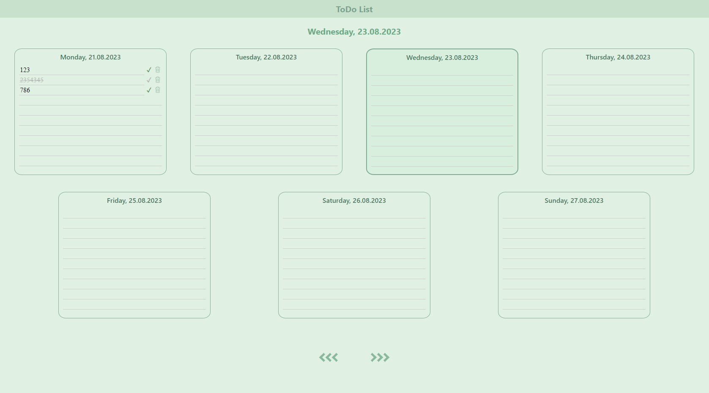
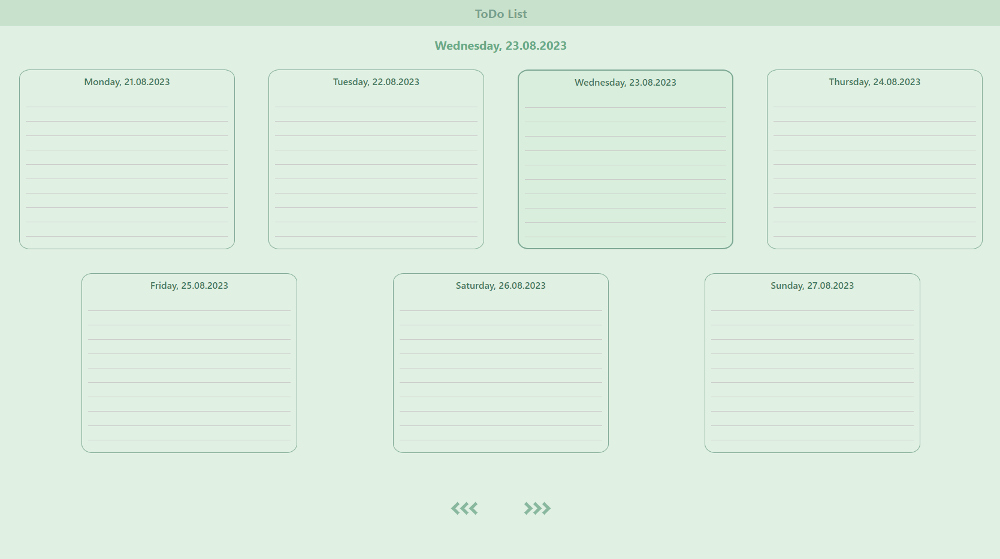

# 
ToDo List

## Description

This is basic todo list for a week created with React + Typescript.  
 **Please note that fake API with json-server was used. In order to check the project functionality please use git clone, `npm ci` + script `npm run dev`.**
***
Базовый список задач на неделю, написанный на базе React + Typescript.  
**В разработке использовался фейковый сервер, созданный с помощью json-server. Чтобы проверить функционал приложения, используйте git clone репозитория, `npm ci` и `npm run dev`.**

## How to use

- Saving todos on enter / onBlur.
- To mark/unmark as completed click on the checkmark on the right side of todo. 
- To delete todo click on the trash icon on the right side of todo.
- To switch the week click on the navigation arrows at the bottom of the todo cards.
***
- Чтобы сохранить задачу, нажать на enter/кликнуть левой кнопкой мыши в любой области приложения.
- Чтобы пометить выполненной/невыполненной, нажать на галочку справа от задачи.
- Чтобы удалить задачу, нажать на иконку мусора справа от задачи.
- Чтобы перейти к следующей/предыдущей неделе, нажать на стрелки под карточками задач.

